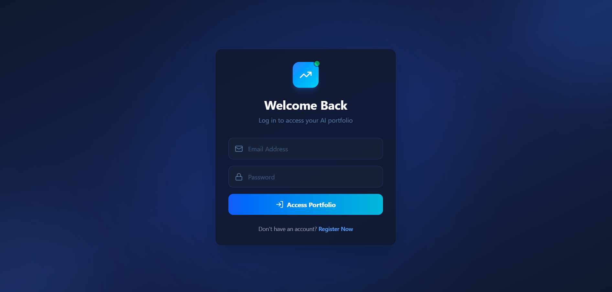
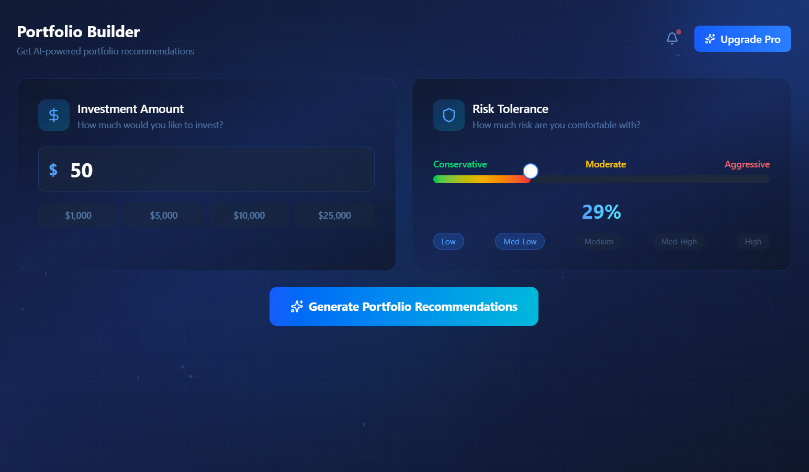
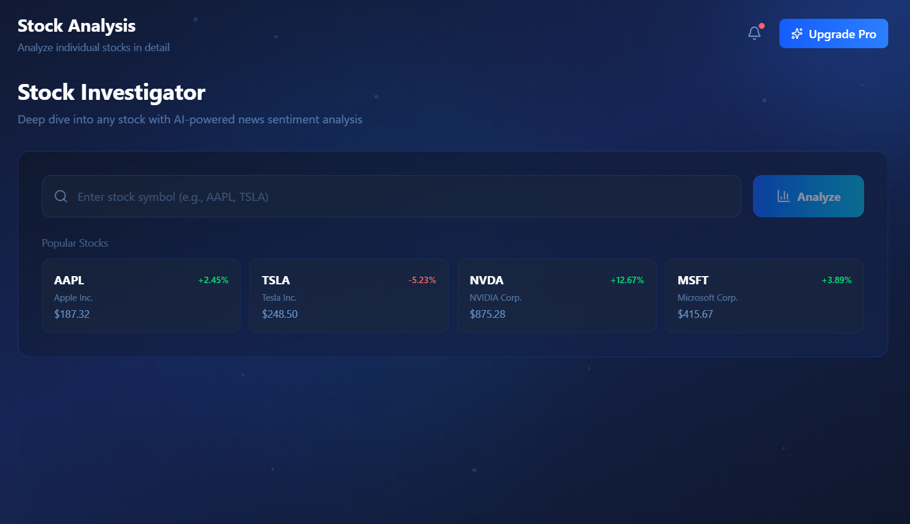
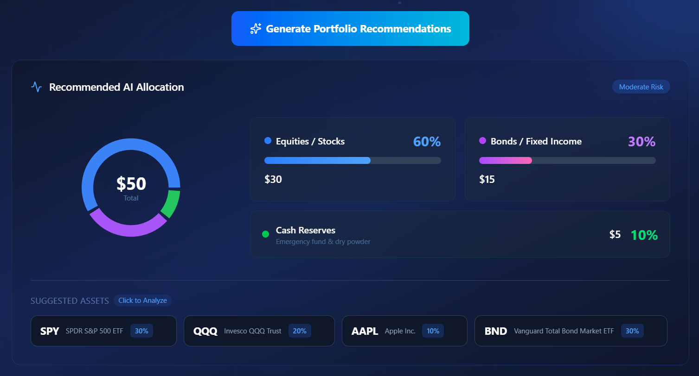
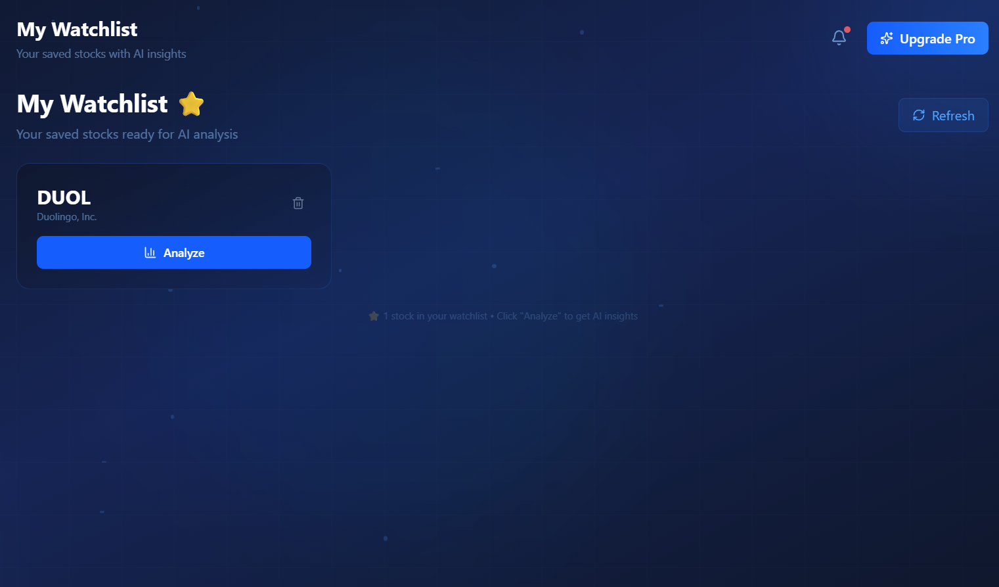
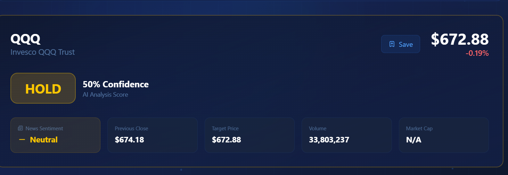

# 📈 StockAdvisor AI: Full-Stack FinTech Dashboard


**StockAdvisor AI** is a comprehensive, full-stack financial technology (FinTech) application that provides users with dynamic portfolio recommendations, real-time stock data visualization, and AI-driven news sentiment analysis.

Built with a modern **React/Vite** frontend and a robust **Python/Flask** backend, this application bridges the gap between raw financial data and actionable, intelligent insights by combining financial mathematics with Natural Language Processing (NLP).

---

## 📸 Application Previews


| | | |
|:---:|:---:|:---:|
| **Login Screen** | **Portfolio Builder** | **Stock Investigator** |
|  |  |  |
| **AI Verdict & Sentiment** | **Watchlist** | **Responsive Charts** |
|  |  |  |

---

## ✨ Key Features

### 🔒 Secure User Authentication
- Registration and login system with `werkzeug.security` password hashing (PBKDF2: SHA-256)
- Persistent **SQLite database** (`advisor.db`) with User and Watchlist tables
- Session management with dynamic user profile display

### 🧠 AI Portfolio Builder
- Dynamic risk-tolerance slider (0-100%) with visual color gradient
- Quick-select investment amount buttons ($1K, $5K, $10K, $25K)
- AI-generated allocation recommendations (Stocks/Bonds/Cash)
- **Interactive Donut Chart** (Recharts) with smart number formatting ($50, $5K, $2.5M)
- **Clickable ticker pills** that bridge to Stock Investigator with auto-analysis

### 📰 Real-Time AI Sentiment Analysis
- Scrapes **Google News RSS feeds** using Python's `urllib` and `xml.etree`
- **VADER (Valence Aware Dictionary and sEntiment Reasoner)** NLP library scores headlines
- Sentiment classification: 🟢 Positive, 🟡 Neutral, 🔴 Negative
- Dynamic confidence scoring adjusts based on BOTH price targets AND news mood

### 📊 Interactive Data Visualization
- **30-day historical price charts** via Yahoo Finance (`yfinance`)
- Color-coded AI verdict badges (STRONG BUY, BUY, HOLD, SELL, STRONG SELL)
- Animated progress bars for portfolio allocation
- News sentiment explanation banner with real-time scores

### ⭐ Persistent Watchlist
- Save analyzed stocks to personal database
- View all saved stocks with smart cards
- One-click "Analyze" to jump back to detailed analysis
- Delete stocks with trash icon
- Refresh button to reload watchlist

---

## 🛠️ Technology Stack & Libraries

### Frontend (The "Face" - React App)

| Technology | Version | Purpose |
|:-----------|:--------|:--------|
| **React.js** | 18.x | UI framework with component-based architecture |
| **Vite** | 5.x | Build tool and development server (faster than CRA) |
| **Tailwind CSS** | 3.x | Utility-first CSS framework for modern glassmorphism UI |
| **Recharts** | 2.x | Composable charting library for interactive SVG charts |
| **Lucide React** | Latest | Beautiful, consistent icon library |

**Frontend Installation Commands:**
```bash
npm create vite@latest frontend -- --template react
cd frontend
npm install
npm install lucide-react recharts tailwindcss @tailwindcss/vite
npm run dev

### Backend (The "Brain" - Python/Flask API)

| Technology | Purpose |
|:-----------|:--------|
| **Python** | 3.10+ | Core server language |
| **Flask** | Lightweight WSGI web application framework |
| **SQLite / SQLAlchemy** | Database and Object Relational Mapper for user data |
| **yFinance** | Fetches live market data and 30-day historical charts |
| **VADER Sentiment** | NLP library for scoring Google News headlines |

**Backend Installation Commands:**
```bash
# Open a new terminal and navigate to the backend folder
cd backend

# Install all required Python dependencies
pip install flask flask-cors yfinance vaderSentiment flask-sqlalchemy

# Start the Flask server (runs on port 5000)
python app.py
